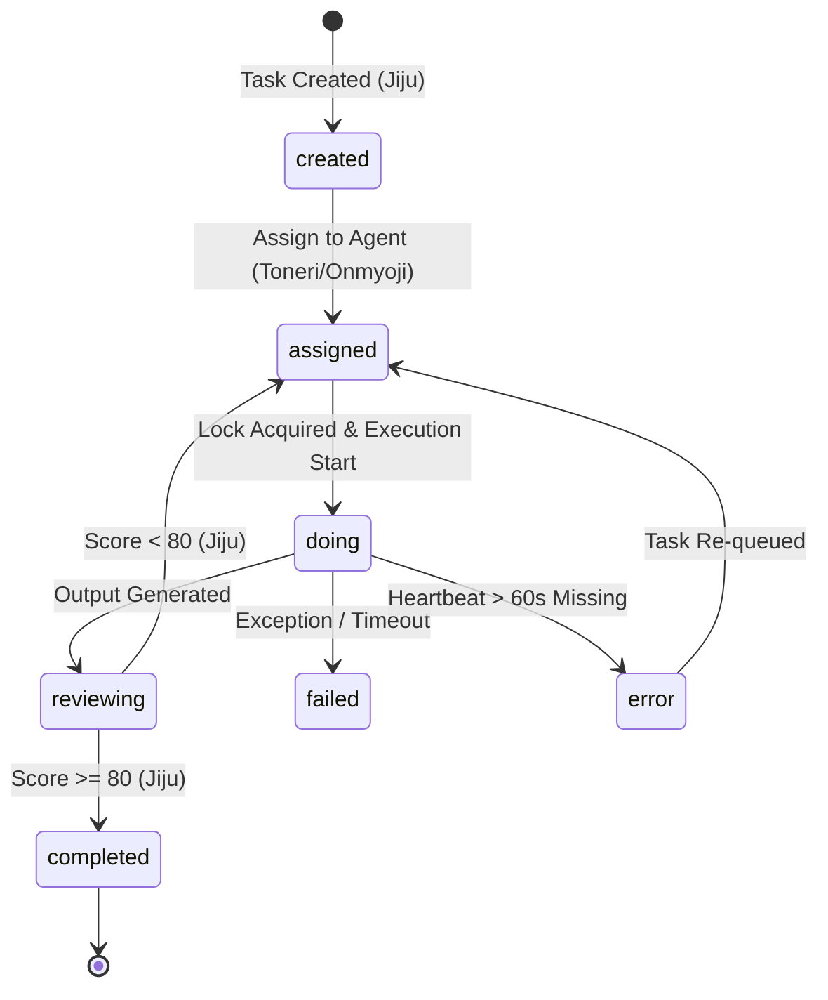
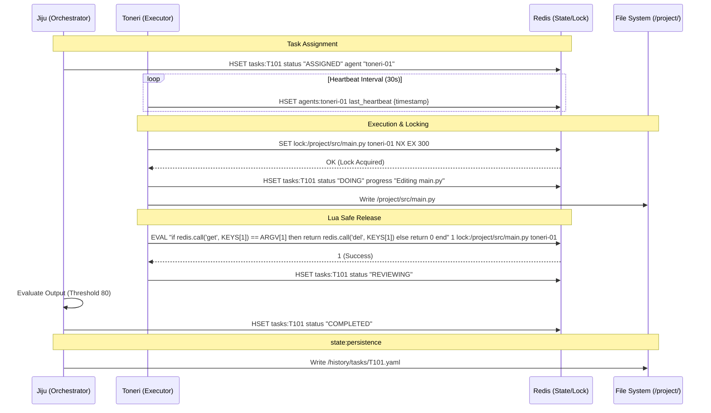

---
codd:
  node_id: design:detailed-agent-flow
  type: design
  depends_on:
  - id: design:state-management-redis
    relation: depends_on
    semantic: technical
  depended_by:
  - id: design:detailed-skill-evolution
    relation: depends_on
    semantic: technical
  conventions:
  - targets:
    - agent:heartbeat
    reason: Heartbeat interval (30s) must be implemented to provide real-time 'Thinking'
      feedback.
  modules:
  - orchestrator
  - agent_jiju
  - agent_toneri
  - agent_onmyoji
---

# Agent State Machine and Sequence Diagrams

## 1. Overview
The Agent State Machine and Sequence Diagrams design specifies the coordination protocol for the Kanpaku system's multi-agent architecture. This document details the transitions and lifecycle of tasks as they move through the Orchestrator (Jiju), the Task Executor (Toneri), and the Code Specialist (Onmyoji). The system relies on a high-frequency state layer in Redis for orchestration and a low-frequency persistence layer in YAML for auditability and drift detection.

Central to this design is the requirement for real-time status visibility. Following the **agent:heartbeat** convention, all agents must provide "Thinking" feedback through a 30-second heartbeat interval. Furthermore, the **db:redis** and **redis:file-lock** constraints ensure that high-concurrency file operations within the `/project/` sandbox remain atomic and collision-free. This document serves as the implementation blueprint for the **module:orchestrator** and **module:executor** components.

## 2. Mermaid Diagrams

The state machine above defines the canonical transitions for any task. The **module:jiju** (Orchestrator) is the primary owner of the `created`, `assigned`, and `completed` transitions. Agents (Toneri/Onmyoji) own the `doing` state. Any transition to `completed` must be accompanied by a drift check against the YAML history in `/history/tasks/` to satisfy the **state:persistence** requirement.

This sequence diagram illustrates the strict adherence to the **db:redis** locking mechanism and the **agent:heartbeat** requirement. The `last_heartbeat` update every 30 seconds provides the "Thinking" feedback to the system, while the Lua-based lock release prevents Toneri agents from accidentally releasing locks that have expired and been re-acquired by other processes.

## 3. Ownership Boundaries
To maintain system integrity and prevent race conditions, the following ownership boundaries are strictly enforced:

*   **Task State Authority:** Jiju is the sole owner of the `tasks:{task_id}` hash for final state transitions (`COMPLETED`, `FAILED`, `REJECTED`). While Toneri updates the `progress` field and `DOING` status, Jiju performs the final verification against the `review:score-threshold`.
*   **Lock Ownership:** The executing agent (Toneri or Onmyoji) owns the lifecycle of `lock:{filepath}`. No other agent or the Orchestrator may modify or delete this lock unless the agent is declared a `ZOMBIE` (heartbeat failure).
*   **Heartbeat Responsibility:** Every agent process is responsible for its own `agents:{agent_id}` hash. If an agent fails to update this hash within 60 seconds (two heartbeat cycles), Jiju assumes process failure.
*   **Persistence Ownership:** The Orchestrator (Jiju) owns the synchronization between the Redis hot state and the `/history/tasks/` YAML cold state. Agents do not write directly to the `/history/` directory.

## 4. Implementation Implications

### 4.1 Heartbeat Mechanism (agent:heartbeat)
Each agent must run a background thread or asynchronous task that updates `HSET agents:{agent_id} last_heartbeat <UNIX_TS>` every 30 seconds. The Orchestrator polls these values. If `now() - last_heartbeat > 60s` (2 missed heartbeat intervals), the agent's current task is transitioned to `PENDING` and the agent is flagged as `ZOMBIE` in the UI to provide real-time feedback of execution health.

### 4.2 Distributed Locking (db:redis, redis:file-lock)
All file I/O operations targeting the `/project/` sandbox must use the following Redis implementation:
*   **Acquire:** `SET lock:{normalized_path} {agent_id} NX EX 300`.
*   **Path Normalization:** Paths must be resolved to absolute paths and verified to reside within `/project/`. Attempts to lock paths outside this root (e.g., `/etc/passwd`) must be rejected by the agent's internal validator before hitting Redis.
*   **Release:** Must use the Lua script described in Section 2 to verify ownership. If the script returns `0`, the agent must log a `LockLostException`.

### 4.3 Task Persistence and Drift (state:persistence)
Before marking a task as `COMPLETED`, the system must:
1.  Verify the `review_score` is >= 80.
2.  Serialize the current Redis task hash into a YAML structure.
3.  Atomic write the YAML to `/history/tasks/T{task_id}.yaml`.
4.  If the YAML write fails, the Redis status must be reverted to `FAILED` to prevent state drift between the live orchestrator and the historical audit trail.

### 4.4 Hardware Context
Execution occurs on an NVIDIA RTX 2070 SUPER. If an agent encounters an `OutOfMemoryError` (VRAM), it must immediately transition its state to `FAILED` and release all Redis locks to allow Jiju to re-evaluate the task's resource requirements.

## 5. Open Questions
1.  **Lock Extension Strategy:** If a complex code generation task by Onmyoji exceeds the 300-second TTL, should the agent automatically attempt a `RENEW` operation on the lock, or should Jiju enforce a hard timeout to prevent stale locks from blocking the sandbox?
2.  **Concurrency Limits:** Should the Orchestrator limit the number of simultaneous `DOING` states based on the 8GB VRAM capacity of the RTX 2070 SUPER to prevent system-wide crashes?
3.  **Partial Completion:** If an agent has written 5 files but fails on the 6th, how should the Redis state reflect the "dirty" state of the `/project/` sandbox for the next assigned agent?
4.  **Audit Cleanup:** At what threshold of tasks in `/history/tasks/` should the system trigger a compression or archival process to maintain file system performance?
