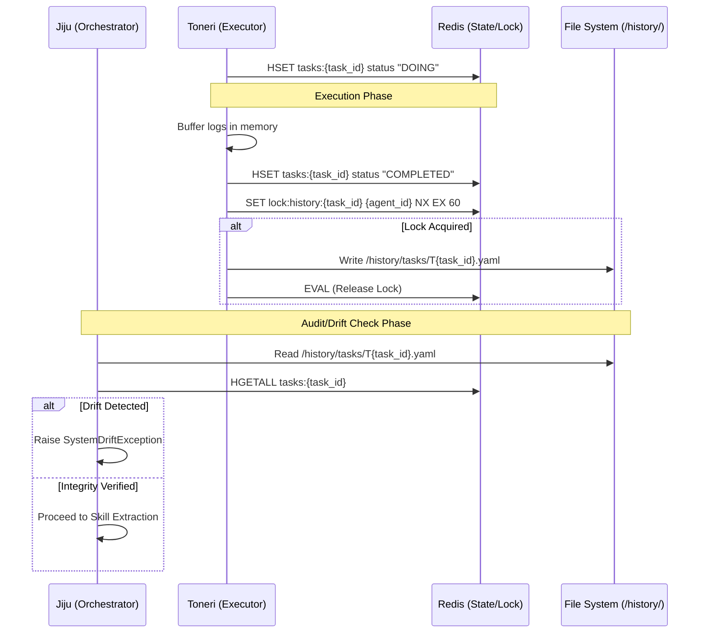
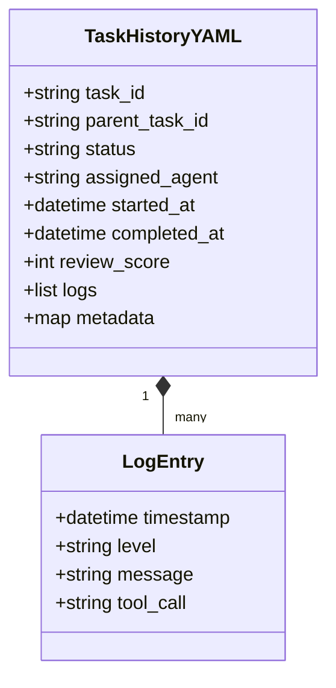

---
codd:
  node_id: design:history-persistence-schema
  type: design
  depends_on:
  - id: design:state-management-redis
    relation: depends_on
    semantic: technical
  depended_by:
  - id: plan:implementation-plan
    relation: depends_on
    semantic: technical
  conventions:
  - targets:
    - module:persistence
    reason: All state changes must be synchronized to YAML files under /history/ for
      auditability.
  modules:
  - persistence
---

# YAML Persistence and Logging Schema

## 1. Overview
The YAML Persistence and Logging Schema defines the mechanism for archiving task lifecycles and agent operations to ensure system-wide auditability and drift detection. In accordance with the **module:persistence** target, all state changes originating in the volatile Redis layer must be synchronized to immutable YAML files located within the `/history/tasks/` directory.

This system serves as the "cold" record of the Kanpaku environment, complementing the "hot" state stored in Redis. While Redis facilitates real-time orchestration via `tasks:{id}` hashes and distributed locks (enforced by the **db:redis** convention), the YAML persistence layer provides the ground truth for auditing, skill extraction, and recovery. This design satisfies the **state:persistence** requirement by enabling the Jiju orchestrator to perform drift detection—comparing the current Redis hash values with the historical YAML record before finalizing any task or extracting knowledge into the vector store.

## 2. Mermaid Diagrams

The diagram above establishes the operational flow for persistence. The **module:executor** (Toneri/Onmyoji) is the primary owner of the initial YAML write upon task completion. However, the **module:jiju** (Orchestrator) owns the verification boundary. Implementation must ensure that the YAML write is guarded by a Redis lock with a 60-second TTL to prevent partial writes if multiple processes attempt to access the same task history during a retry scenario.

The class structure defines the mandatory schema for the YAML files. The **module:persistence** implementation must enforce this schema strictly to allow downstream consumers (like the Onmyoji skill extraction engine) to parse task outcomes reliably. The `review_score` field is critical; it must reflect the value stored in Redis to pass the drift detection check, adhering to the threshold of >= 80 for successful extraction.

## 3. Ownership Boundaries
To maintain data integrity and prevent reimplementation drift, the following ownership boundaries are strictly enforced:

*   **YAML Creation Ownership:** The **module:executor** (Toneri or Onmyoji) currently executing the task owns the creation of the YAML file. It is responsible for flushing its in-memory log buffer to `/history/tasks/T{task_id}.yaml` exactly once upon transitioning the task to a terminal state (`COMPLETED` or `FAILED`).
*   **Audit & Drift Detection Ownership:** The **module:jiju** (Orchestrator) owns the logic for verifying the YAML file against the Redis state. This occurs during the `ANALYZE_CREATING` phase. Jiju is the only entity permitted to mark a task as "Verified" in the metadata.
*   **Log Formatting Ownership:** A shared **utility:logger** module owns the transformation of internal execution events into the structured `LogEntry` YAML format. This ensures consistency across different agent types.
*   **Storage Path Ownership:** The system root owns the `/history/` directory. All agents must have write access to `/history/tasks/`, but read access is restricted to the Jiju orchestrator and the Onmyoji analyst during specific workflow phases to maintain tenant isolation and security.

## 4. Implementation Implications
The following technical constraints and operational rules must be reflected in the code:

*   **File Naming and Location:** All task histories must be stored as `/history/tasks/T{task_id}.yaml`. The `task_id` must be a UUID or a strictly incrementing integer provided by the Redis `task_counter`.
*   **Atomic Persistence (state:persistence):** Before the Jiju orchestrator considers a task "Finalized," it must confirm that the file exists and that the `completed_at` timestamp in the YAML is within 1000ms of the Redis `updated_at` field. If the discrepancy exceeds this threshold, a `DriftWarning` is logged.
*   **Concurrency Control (redis:file-lock):** Agents must acquire a Redis lock named `lock:history:{task_id}` using `SET NX EX 60` before writing to the YAML file. This prevents race conditions during task reassignment or timeout recovery where a "zombie" agent might attempt to write to a task history that has already been reassigned.
*   **Performance Thresholds:** YAML serialization and write operations must complete within 200ms to avoid blocking the agent's release of the primary Redis task lock. Large logs must be truncated at 50,000 characters to prevent filesystem bloat, with a pointer to a separate `.log` file if necessary.
*   **Security and Privacy:** YAML files must not contain raw environment variables or unencrypted credentials. The **module:executor** must sanitize all `tool_call` entries in the `logs` array, replacing sensitive strings with `[REDACTED]` before writing to disk.

## 5. Open Questions
1.  **Log Rotation:** At what volume should the `/history/tasks/` directory be archived or compressed (e.g., 10,000 files or 1GB total size) to prevent degradation of directory listing performance?
2.  **Partial Persistence:** Should agents perform incremental writes to the YAML file during long-running tasks (e.g., every 5 minutes) to prevent loss of logs in the event of a hard system failure, or does the Redis-first strategy provide sufficient protection?
3.  **Schema Versioning:** How should the YAML schema evolve if new metadata fields are required for future Onmyoji analysis versions without breaking the drift detection logic for existing historical files?
4.  **Verification Metadata:** Should the YAML file include a cryptographic hash of the `/project/` sandbox state at the time of completion to further strengthen the drift detection mechanism?
