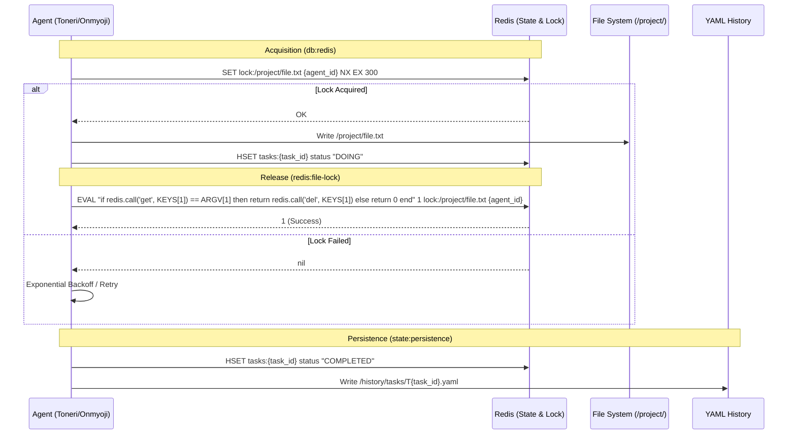
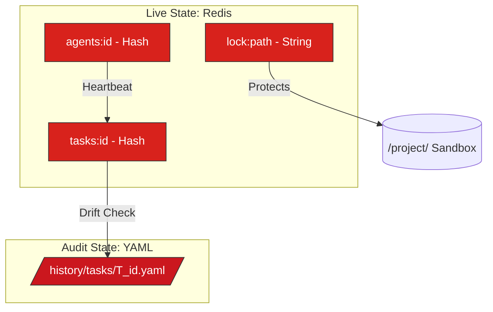

---
codd:
  node_id: design:state-management-redis
  type: design
  depends_on:
  - id: design:system-design
    relation: depends_on
    semantic: technical
  - id: design:security-sandbox
    relation: depends_on
    semantic: technical
  depended_by:
  - id: design:task-lifecycle-flow
    relation: depends_on
    semantic: technical
  - id: design:history-persistence-schema
    relation: depends_on
    semantic: technical
  - id: design:detailed-agent-flow
    relation: depends_on
    semantic: technical
  conventions:
  - targets:
    - redis:file-lock
    reason: File operations must use Redis locks with safe ownership verification
      to prevent race conditions.
  - targets:
    - db:redis
    reason: Distributed locking must use SET NX EX with Lua script verification for
      safe release.
  - targets:
    - state:persistence
    reason: Current state must be in Redis, while history must be persisted as YAML
      to allow drift detection.
  modules:
  - storage
  - state
  - redis_client
---

# Redis State and Lock Design

## 1. Overview
The Redis State and Lock Design defines the high-concurrency coordination layer for the Kanpaku system. This design ensures system-wide consistency across multiple agents (Jiju, Toneri, and Onmyoji) by utilizing Redis as the authoritative live state store and a distributed lock manager. The implementation adheres to the **db:redis** constraint by using `SET NX EX` for atomic lock acquisition and Lua scripts for idempotent, ownership-aware releases.

In compliance with **state:persistence**, this system maintains a "hot" state in Redis for real-time orchestration while persisting a "cold" history as YAML files in `/history/tasks/`. This dual-layer approach allows for high-performance task transitions while providing a mechanism for drift detection and auditability. To satisfy **redis:file-lock**, all file operations within the `/project/` sandbox are guarded by Redis keys that verify agent ownership, preventing race conditions between executing Toneri agents.

## 2. Mermaid Diagrams

The sequence above illustrates the atomic lifecycle of a file-bound task. The **module:executor** is the canonical owner of the lock acquisition logic, ensuring that no file write occurs without a valid TTL-backed lock. The **module:jiju** acts as the supervisor, monitoring the `last_heartbeat` in Redis and performing drift detection by comparing Redis hash values with the YAML audit trail before finalizing the `ANALYZE_CREATING` phase.

This diagram establishes the structural boundaries: Redis manages the volatile, high-frequency updates (heartbeats, status changes, locks), while the File System holds the immutable historical record. Compliance with **state:persistence** requires that any discrepancy between a `COMPLETED` task in Redis and its corresponding YAML file triggers a `System Drift` exception.

## 3. Ownership Boundaries
To prevent implementation drift and ensure operational integrity, the following ownership boundaries are enforced:

*   **Distributed Lock Ownership:** The **module:executor** (Toneri/Onmyoji) owns the responsibility for acquiring and releasing `lock:{filepath}`. It must provide a unique `agent_id` during acquisition. Locks are strictly scoped to the `/project/` directory.
*   **State Transition Ownership:** The **module:jiju** (Orchestrator) is the sole authority for transitioning tasks to `COMPLETED` or `FAILED`. While agents update their `DOING` status, Jiju performs the final verification against the `review:score-threshold` (>= 80) before updating Redis and triggering the YAML persistence.
*   **Heartbeat Ownership:** Every active agent process owns its `agents:{agent_id}` hash. It must update the `last_heartbeat` field every 30 seconds.
*   **Audit Ownership:** The **module:kanpaku** owns the drift detection logic. During the transition from `COMPLETED` to the skill extraction phase, Kanpaku reads both the Redis `tasks:{id}` hash and the `/history/tasks/T{id}.yaml` file to ensure integrity.

## 4. Implementation Implications
Implementation must satisfy the following technical constraints derived from the system requirements:

*   **Atomic Locking (db:redis):** 
    *   Lock acquisition command: `SET lock:{path} {agent_uuid} NX EX 300`. 
    *   The 300-second (5-minute) TTL is mandatory to prevent deadlocks in the event of an agent crash.
    *   Safe Release: Release must be performed via a Lua script to ensure an agent only deletes a lock it actually owns.
    *   Lock Extension: For long-running operations, agents can extend the lock TTL: `EXPIRE lock:{filepath} 300`
    *   Lock Format: Locks store agent ownership information: `{by: agent_id}`
*   **Path Validation (redis:file-lock):**
    *   Before a lock is requested, the executor must normalize the path and verify it begins with the `/project/` absolute path. Parent directory traversal (`../`) is intercepted at the application layer, returning a `Forbidden` error before Redis is even queried.
    *   Lock Ownership Check: Before releasing a lock, verify ownership: `if lock.by != self: deny()`
    *   Safe Release Lua Script: `if redis.call("GET", key).by == my_id then return redis.call("DEL", key) end`
*   **Persistence and Drift Detection (state:persistence):**
    *   Redis Hash Fields: `status`, `assigned_agent`, `priority`, `review_score`, `updated_at`.
    *   YAML Structure: Matches the Redis hash but adds a `logs` array for execution history.
    *   Drift Detection: If `Redis.status == 'COMPLETED'` but the YAML file is missing or contains a different `review_score`, the system must halt and enter a recovery state to prevent corrupting the Chroma DB skill store.
*   **Timeout & Heartbeat (agent:timeout-policy):**
    *   Agents failing to update Redis within 60 seconds (2x heartbeat interval) are marked as `zombie`. 
    *   The Orchestrator identifies `zombie` agents, clears their associated `lock:{filepath}` (if TTL hasn't expired), and moves their current task back to the `ASSIGNED` pool.

## 5. Open Questions
1.  **Lock Extension:** In cases where a Toneri agent's "Doing" phase approaches the 120-second threshold or the 300-second Redis TTL, should the agent proactively extend the lock, or should the task be terminated to strictly enforce the temporal sandbox?
2.  **Cluster Support:** While the current design assumes a single Redis instance, how will the locking logic evolve if the system scales to a Redis Cluster where `EVAL` scripts must ensure all keys are in the same hash slot?
3.  **VRAM-Aware State:** Should the `agents:{agent_id}` hash include current VRAM usage to allow Jiju to perform load-balanced task assignment across the NVIDIA RTX 2070 SUPER?
4.  **YAML Archival:** What is the trigger for archiving old YAML history files to prevent `/history/tasks/` from becoming a performance bottleneck during drift detection?
