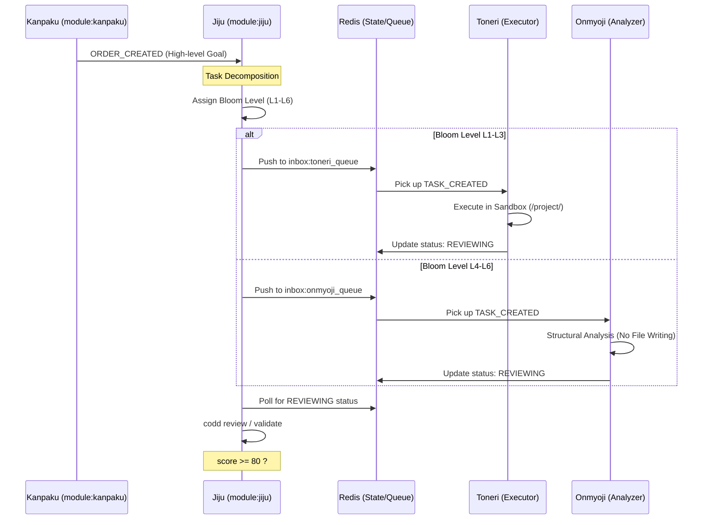

---
codd:
  node_id: design:routing-bloom-taxonomy
  type: design
  depends_on:
  - id: design:system-design
    relation: depends_on
    semantic: technical
  depended_by:
  - id: design:task-lifecycle-flow
    relation: depends_on
    semantic: technical
  conventions:
  - targets:
    - module:jiju
    reason: 'Tasks must be routed based on Bloom levels: L1-L3 to Toneri, L4-L6 to
      Onmyoji.'
  modules:
  - routing
  - agents
---

# Bloom's Taxonomy Routing Logic

## 1. Overview
The Bloom's Taxonomy Routing Logic is the core decision engine within the `module:jiju` orchestrator. It ensures that decomposed tasks are assigned to the most appropriate agent class based on the cognitive complexity of the requirement. By categorizing tasks according to the six levels of Bloom's Taxonomy, the system optimizes resource allocation across the **infra:llm-stack**, ensuring high-reasoning models (e.g., `gemma4-26B-A4B`) handle structural analysis while efficient execution models (e.g., `Bonsai-8B`) handle implementation.

The routing logic acts as a gateway between the `TASK_CREATED` state and the `ASSIGNED` state. Every task generated by Jiju is tagged with a Bloom level (L1–L6). Tasks tagged L1 (Remember), L2 (Understand), or L3 (Apply) are routed to the **Toneri** execution layer. Tasks tagged L4 (Analyze), L5 (Evaluate), or L6 (Create) are routed to the **Onmyoji** architectural layer. This division maintains the imperial hierarchy where executors handle labor and analyzers handle strategy.

## 2. Mermaid Diagrams

The diagram above illustrates the canonical flow of task assignment. Jiju maintains ownership of the routing logic and the lifecycle transition from `TASK_CREATED` to `ASSIGNED`. The use of Redis streams (`inbox:{agent_id}`) ensures that even if multiple Jiju processes are running, task distribution remains atomic. Toneri agents are strictly bound to the `/project/` sandbox for file operations, while Onmyoji agents are restricted from direct file execution, focusing solely on the generation of structural patterns or evaluation reports.

## 3. Ownership Boundaries
*   **module:jiju (The Router):** Jiju is the sole owner of the classification logic. It must evaluate the prompt context and metadata to determine the Bloom Level. No other module is permitted to change a task's Bloom Level once it is persisted to the `tasks:{task_id}` hash in Redis. Jiju is also responsible for monitoring the `Thinking Timeout` (300s) and `Doing Timeout` (120s) constraints.
*   **module:kanpaku (The Interface):** Kanpaku provides the initial order but does not participate in Bloom classification. It only monitors the final output and provides the dashboard for the Mikado.
*   **Toneri Agents (The Executors):** Owned by the execution subsystem, these agents own the responsibility of file-system interactions within the `/project/` prefix. They must use `Bonsai-8B` or `DeepSeek 6.7B` as defined in the **infra:llm-stack**.
*   **Onmyoji Agents (The Analyzers):** Owned by the reasoning subsystem, these agents own the architectural review process. They utilize `gemma4-26B-A4B` to ensure high-fidelity analysis. They are prohibited from acquiring the Redis `lock:{filepath}` for write operations.

## 4. Implementation Implications
*   **Model Mapping:**
    *   **L1-L3 (Toneri):** Implementation must use llama.cpp or Ollama endpoints serving `Bonsai-8B` or `DeepSeek 6.7B`. The system must prioritize `Bonsai-8B` for coding tasks and `gemma4-E2B` for simple text transformations.
    *   **L4-L6 (Onmyoji):** Implementation must exclusively use `gemma4-26B-A4B` via Ollama to handle the high-context windows required for architectural evaluation.
*   **Redis State Management:** 
    *   Jiju must set the `bloom_level` field in the Redis `tasks:{task_id}` hash. 
    *   The routing worker in Jiju must push the `task_id` into the correct queue: `inbox:toneri` or `inbox:onmyoji`.
*   **Security and Sandbox Controls:** 
    *   Toneri agents must include a middleware check for all I/O operations to verify the `/project/` prefix.
    *   Onmyoji agents must have their execution environment configured without write permissions to the `/project/` directory to prevent unauthorized architectural "drift" through direct file modification.
*   **Performance Invariants:**
    *   Routing must occur within 500ms of task decomposition.
    *   Heartbeat checks (30s interval) must be performed by Jiju for all agents currently in `DOING` status, regardless of their Bloom routing.
*   **SLA/Performance:** 
    *   The system must support at least 5 concurrent Toneri agents and 2 concurrent Onmyoji agents within the 64GB RAM budget. 
    *   VRAM allocation for `gemma4-26B-A4B` (Onmyoji) must be prioritized over Toneri executors during `ANALYZE_CREATING` events.

## 5. Open Questions
*   **Level Re-classification:** If a Toneri agent (L1-L3) repeatedly fails a task due to unexpected complexity, should Jiju automatically escalate the task to L4-L6 (Onmyoji), or should it remain a `FAILED` task for the Mikado to intervene?
*   **Mixed-Level Tasks:** In cases where a single decomposition unit contains both "Apply" (L3) and "Analyze" (L4) requirements, how should the Jiju tie-breaker logic behave? Current logic defaults to the higher level (Onmyoji).
*   **VRAM Dynamic Shifting:** Given the hardware limit of 8GB VRAM (RTX 2070 SUPER), what is the specific signal for Jiju to pause Toneri execution queues to free up memory for Onmyoji inference?
*   **Skill Context Injection:** When Jiju retrieves skills from Chroma DB, should the number of injected skills (currently top 3) vary based on the Bloom level (e.g., more examples for L3, more abstract patterns for L5)?
