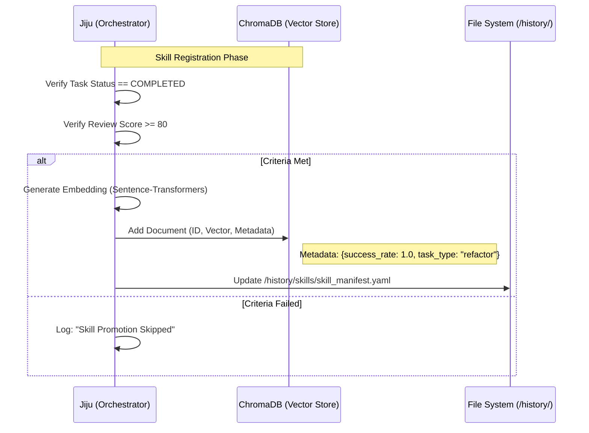
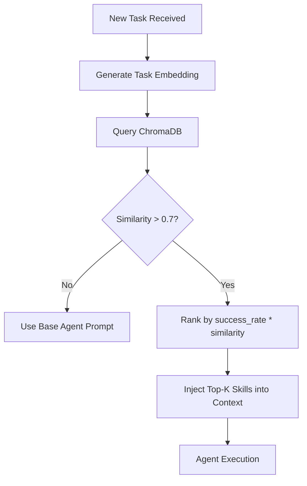

---
codd:
  node_id: design:detailed-skill-evolution
  type: design
  depends_on:
  - id: design:detailed-agent-flow
    relation: depends_on
    semantic: technical
  depended_by:
  - id: plan:implementation-plan
    relation: depends_on
    semantic: technical
  conventions:
  - targets:
    - skill:retrieval-logic
    reason: Skill search must prioritize success_rate and similarity to prevent regression.
  - targets:
    - db:chroma
    reason: Skills are only registered if review score >= 80 and the task is successfully
      completed.
  modules:
  - skill_manager
  - agent_onmyoji
  - vector_db
---

# Skill Evolution and VectorDB Design

## 1. Overview
The Skill Evolution and VectorDB Design defines the mechanism by which the Kanpaku system transforms successful task executions into reusable "Skills." This evolutionary process ensures that the system does not repeat past mistakes and continuously improves its execution efficiency. By leveraging ChromaDB as the primary vector store, the system provides agents like Toneri (Executor) and Onmyoji (Code Specialist) with a contextually relevant library of past solutions.

This design enforces strict quality controls. Following the **db:chroma** convention, a task result is only eligible for promotion to a Skill if it achieves a review score of 80 or higher and is marked as `COMPLETED`. The retrieval process, governed by the **skill:retrieval-logic** convention, balances semantic similarity with historical success rates to prevent the retrieval of high-similarity but low-reliability code patterns. All embedding operations and vector searches are optimized for the NVIDIA RTX 2070 SUPER, balancing VRAM usage between inference and retrieval.

## 2. Mermaid Diagrams

The sequence above details the registration boundary. The **module:orchestrator** (Jiju) acts as the exclusive gatekeeper for **db:chroma**. This centralized ownership ensures that the vector database remains free of "noise" from failed attempts or low-quality code. The synchronization with the `/history/` directory ensures that the vector store can be reconstructed from YAML audit trails if the ChromaDB index is corrupted.

The retrieval flow implements the **skill:retrieval-logic** requirement. Unlike standard RAG systems that rely solely on distance metrics, this system applies a weighted ranking algorithm. Even if a past skill is highly similar, its weight is dampened if its historical success rate is marginal. This logic is embedded within the Agent's pre-execution hook to ensure all tasks are "informed" by the system's best previous performances.

## 3. Ownership Boundaries
To ensure architectural integrity and avoid state drift, the following boundaries are established:

*   **VectorDB Write Authority:** Only Jiju (Orchestrator) has permission to perform `collection.add()` or `collection.update()` operations in ChromaDB. This occurs strictly after the task state transition to `COMPLETED` has been verified in the Redis state layer.
*   **Embedding Model Ownership:** The embedding service (e.g., `sentence-transformers/all-MiniLM-L6-v2`) is a shared utility managed by the Orchestrator. Agents request embeddings via an internal RPC to minimize VRAM fragmentation on the RTX 2070 SUPER.
*   **Skill Metadata Schema:** The structure of metadata stored in Chroma (e.g., `success_rate`, `execution_time`, `agent_type`) is defined by the Orchestrator. Agents are restricted to read-only access for querying these fields.
*   **Persistence Sync:** The Orchestrator is responsible for maintaining the 1:1 mapping between ChromaDB entries and the persistent YAML task records in `/history/tasks/`.

## 4. Implementation Implications

### 4.1 Skill Registration (db:chroma)
Registration must strictly follow the rule: `(score >= 80) AND (status == COMPLETED)`.
*   **Threshold Enforcement:** Jiju must check the `review_score` field in the task's Redis hash. If the score is 79, the skill is rejected from the VectorDB, even if the code works perfectly. This ensures a high-quality "gold set" of examples.
*   **Deduplication:** Before adding a new skill, Jiju performs a similarity check. If a skill with >95% similarity already exists, the system updates the `success_rate` and `last_used` metadata of the existing record instead of creating a duplicate.

### 4.2 Retrieval Logic (skill:retrieval-logic)
Retrieval is performed during the `PENDING` to `ASSIGNED` transition.
*   **Priority Ranking:** Skills are ranked by explicit priority order rather than weighted coefficients:
    1. **success_rate** (highest priority)
    2. **similarity_score** 
    3. **usage_count**
*   **Selection Process:** The system retrieves the top 3 skills based on this priority ranking, ensuring that historically reliable patterns are preferred over high-similarity but low-success patterns.
*   **Context Window Management:** Top-3 skills are injected into the agent's system prompt. If the skills exceed 1,000 tokens, the system truncates the code snippets, prioritizing the "Implementation Summary" section of the YAML.

### 4.3 Performance and Security
*   **VRAM Constraints:** Since the RTX 2070 SUPER has only 8GB VRAM, the embedding model must be kept resident in memory while the agent is in the `DOING` state. To prevent OOM, the system uses a quantized version of the embedding model.
*   **Tenant Isolation:** While the current design is single-tenant, the ChromaDB implementation uses `collection_name = "tenant_id_skills"` to ensure future multi-tenant compatibility and data privacy.
*   **Heartbeat Integration:** During the embedding and retrieval phase, Jiju must continue to update the `agent:heartbeat` every 30 seconds to signify "Retrieving Context" to the user.

## 5. Open Questions
1.  **Skill Obsolescence:** If a library update makes a highly-rated skill (Score 95) technically obsolete or prone to errors, should the `success_rate` be manually reset, or should the system rely on the ranking algorithm to naturally deprecate it?
2.  **Cross-Agent Learning:** Should a skill generated by Onmyoji (Code Specialist) be prioritized for retrieval when Toneri (General Executor) is assigned a similar task, or should skills be siloed by agent type?
3.  **Embedding Batching:** In a high-concurrency scenario where multiple tasks are completed simultaneously, should Jiju batch embedding requests to optimize RTX 2070 SUPER compute cycles?
4.  **Feedback Loops:** If an agent uses a retrieved skill and fails, should the `success_rate` of the *source* skill be penalized immediately, or only after a manual review?
