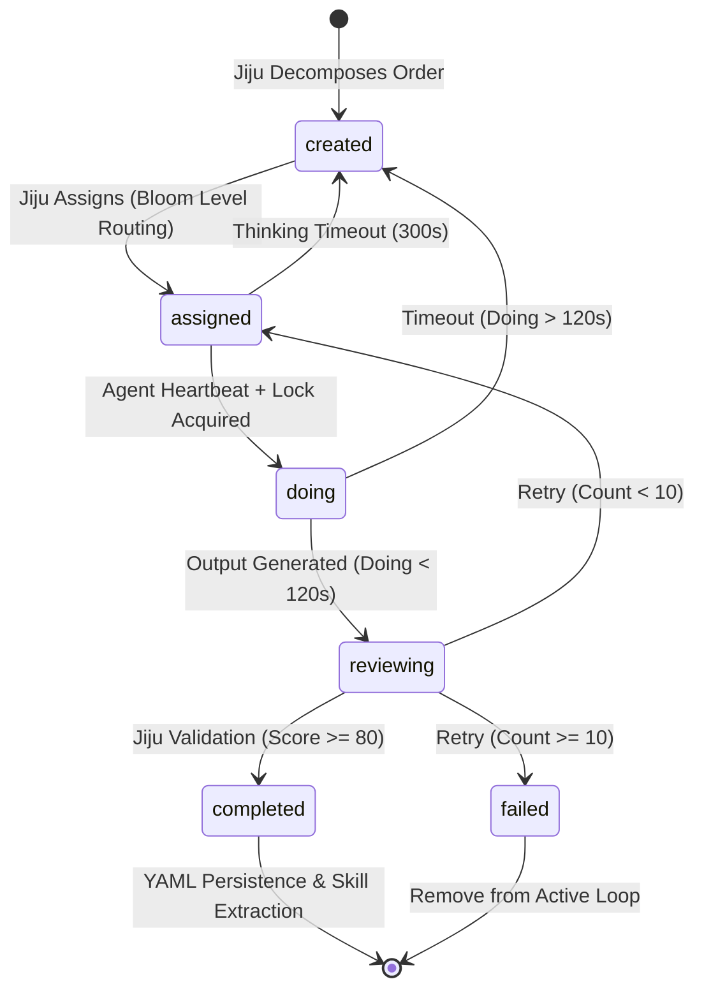
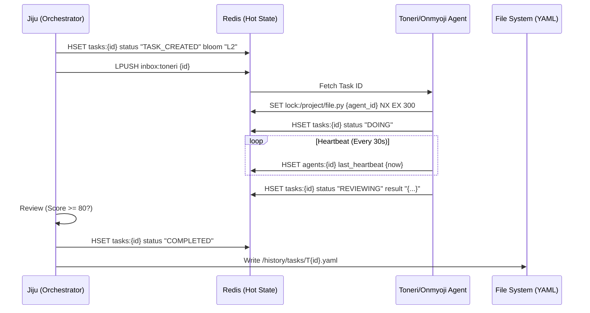

---
codd:
  node_id: design:task-lifecycle-flow
  type: design
  depends_on:
  - id: design:state-management-redis
    relation: depends_on
    semantic: technical
  - id: design:routing-bloom-taxonomy
    relation: depends_on
    semantic: technical
  depended_by:
  - id: plan:implementation-plan
    relation: depends_on
    semantic: technical
  - id: ops:monitoring-guide
    relation: depends_on
    semantic: technical
  conventions:
  - targets:
    - module:monitor
    reason: Thinking timeout is 300s, Doing timeout is 120s; heartbeat interval is
      30s.
  - targets:
    - module:task_manager
    reason: Tasks reaching retry count 10 must be marked as 'failed' and removed from
      the active loop.
  modules:
  - state
  - agents
  - monitor
---

# Detailed Task Lifecycle and State Transitions

## 1. Overview
The Task Lifecycle and State Transitions design specifies the deterministic flow of units of work through the Kanpaku system. It governs how the **module:jiju** orchestrator decomposes high-level orders into granular tasks, routes them based on Bloom's Taxonomy, and manages their execution through **Toneri** and **Onmyoji** agents. This document synthesizes the requirements for high-concurrency state management in Redis, YAML-based historical persistence for auditability, and strict operational constraints including specific timeouts (300s/120s), heartbeat intervals (30s), and a terminal retry threshold (10 attempts).

By enforcing these transitions, the system ensures that every task is either successfully integrated into the codebase with a review score of >= 80 or definitively failed and removed from the active loop, maintaining the integrity of the `/project/` sandbox and the Chroma DB skill store.

## 2. Mermaid Diagrams

The state machine above defines the canonical lifecycle owned by **module:task_manager**. Transitioning from `created` to `assigned` requires **module:jiju** to evaluate the Bloom Taxonomy level (L1-L3 for Toneri, L4-L6 for Onmyoji). The `doing` state is strictly bound by a 120-second execution window. If an agent fails to transition to `reviewing` within this window, or if the `thinking` phase (assignment to doing) exceeds 300 seconds, the task is reset to `created` and the `retry_count` is incremented.

This sequence illustrates the interaction between the hot state (Redis) and cold persistence (YAML). Compliance with **state:persistence** is achieved by only writing to the YAML history once Jiju has confirmed the `COMPLETED` state. The **module:monitor** observes the Redis `last_heartbeat` and `status_updated_at` fields to enforce the 30s heartbeat and 120s/300s timeout constraints.

## 3. Ownership Boundaries
To maintain system stability across the distributed agent architecture, the following ownership rules are enforced:

*   **module:jiju (The Orchestrator):** 
    *   Owns the `bloom_level` classification and routing to the appropriate agent queue.
    *   Owns the final transition to `COMPLETED` or `FAILED`.
    *   Solely responsible for incrementing the `retry_count` in the Redis `tasks:{task_id}` hash.
*   **module:task_manager:** 
    *   Owns the lifecycle terminal logic. It must monitor tasks and, upon reaching `retry_count == 10`, update the status to `failed` and move the record from the active Redis keyspace to the terminal `/history/tasks/` YAML storage.
*   **module:monitor:**
    *   Owns the enforcement of temporal constraints: **Thinking timeout (300s)**, **Doing timeout (120s)**, and **heartbeat interval (30s)**.
    *   If a heartbeat is missing for > 60s, the monitor must flag the agent as `zombie` and trigger a task reset.
*   **Agents (Toneri/Onmyoji):**
    *   Own the `DOING` state logic, including atomic lock acquisition via `SET NX EX`.
    *   Toneri owns file-system modifications strictly within the `/project/` prefix.

## 4. Implementation Implications
The following implementation rules are non-negotiable for system compliance:

*   **Timeout & Retry Logic (module:monitor & module:task_manager):**
    *   **Thinking Timeout:** A task in `ASSIGNED` status for more than 300 seconds without transitioning to `DOING` must be returned to the queue and its retry count incremented.
    *   **Doing Timeout:** A task in `DOING` status for more than 120 seconds is terminated. The agent's associated Redis lock must be released via the Lua safety script, and the task reset.
    *   **Heartbeat Monitoring:** Agents must update their heartbeat every 30 seconds. If an agent fails to update within 60 seconds (2 missed intervals), it is flagged as `ZOMBIE` and its tasks are returned to the queue.
    *   **Retry Ceiling:** Any task reaching **10 retries** must be marked `failed` and removed from the active loop to prevent infinite recursion and resource exhaustion.
*   **Exponential Backoff:** Retry delays follow an exponential backoff algorithm: `delay = base_delay * (2^retry_count)` with a maximum ceiling of 300 seconds to prevent excessive resource consumption during failure cascades.
*   **Distributed Locking (db:redis):**
    *   All agents must use `SET lock:{filepath} {agent_id} NX EX 300` to acquire a lock before any file operation.
    *   Lock release must be performed via a Lua script: `if redis.call("get",KEYS[1]) == ARGV[1] then return redis.call("del",KEYS[1]) else return 0 end`.
*   **State Persistence (state:persistence):**
    *   The Redis hash `tasks:{id}` is the source of truth for the active lifecycle. 
    *   Upon reaching `COMPLETED`, a YAML file must be generated at `/history/tasks/T{id}.yaml` containing the full task definition, agent logs, and the final Jiju review score.
*   **Routing (module:jiju):**
    *   Tasks classified as L1 (Remember), L2 (Understand), or L3 (Apply) are routed to `inbox:toneri`.
    *   Tasks classified as L4 (Analyze), L5 (Evaluate), or L6 (Create) are routed to `inbox:onmyoji`.
    *   Onmyoji agents are restricted from acquiring Redis file locks; they produce analysis reports only.

## 5. Open Questions
1.  **Retry Backoff:** Should the system implement an exponential backoff between retries (1 to 10) to allow for temporary resource constraints (e.g., VRAM spikes) to subside?
2.  **Partial Completion:** If a Toneri agent completes 90% of a task before a 120s timeout, should Jiju attempt to checkpoint the partial progress in Redis, or is a full rollback to `TASK_CREATED` required for consistency?
3.  **Onmyoji Review Loop:** If an Onmyoji (L4-L6) evaluation leads to the rejection of a Toneri (L1-L3) implementation, does that count toward the 10-retry limit of the implementation task, or does it trigger a new architectural task?
4.  **YAML Drift:** How frequently should Jiju perform a sweep to ensure all `COMPLETED` tasks in Redis have a corresponding and identical YAML record in the history directory?
